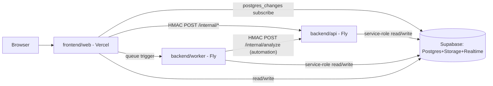
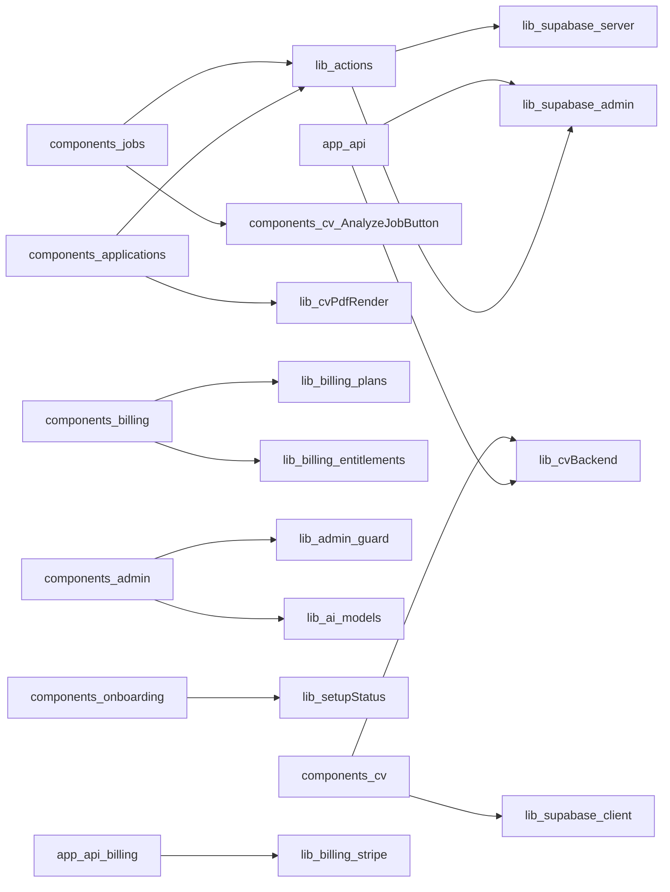
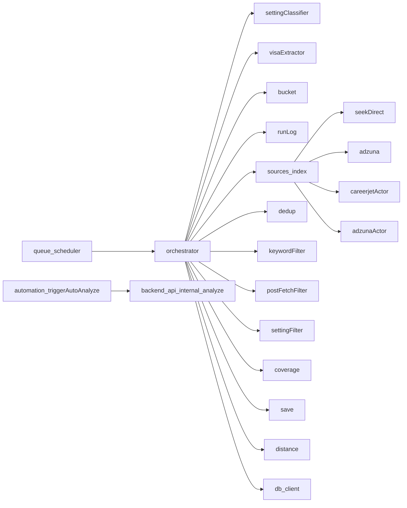
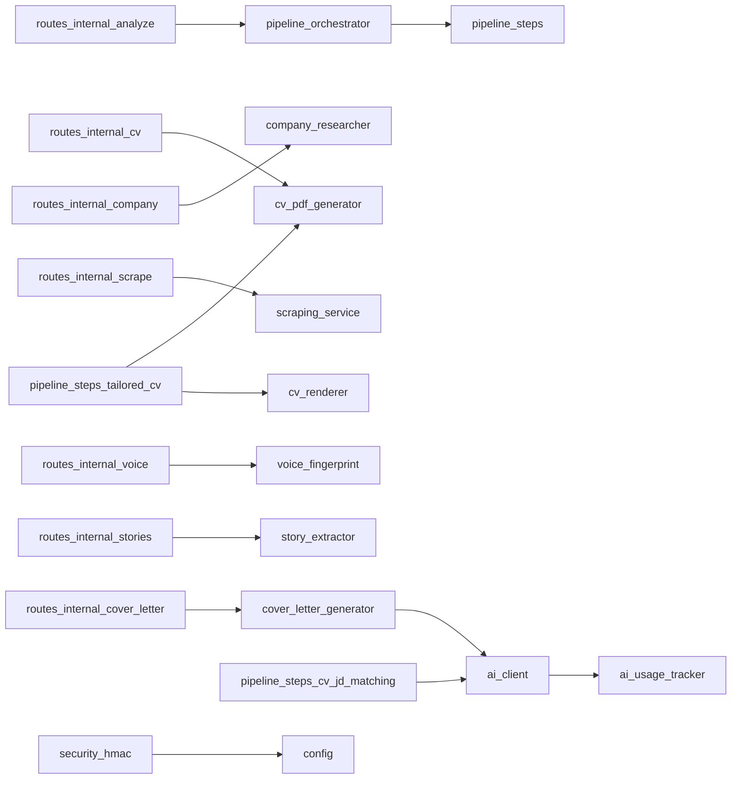

# JobTrackr-CV — Architecture Map

> Generated by read-only repo exploration. Structural facts only — for narrative
> design/decisions see `docs/design.md` (source of truth for "what") and
> `.claude/graph.json` (live state, "how far"). Regenerate rather than hand-edit
> when the repo shape changes materially.

## 1. Module Inventory

### 1a. Top-level packages

| Package | Responsibility | LOC (approx) | Lang/Framework |
|---|---|---|---|
| `frontend/web` | JobTrackr UI: dashboard, CV studio, applications, billing, admin, auth | ~34,000 | Next.js 16 App Router, TS, Tailwind v4 |
| `backend/worker` | Job-discovery pipeline: multi-source scraping, dedup, classification | ~12,061 | Node 22, TypeScript, BullMQ |
| `backend/api` | CV-tailoring pipeline, cover letters, company research, PDF gen | ~13,000 | Python 3.11, FastAPI, ReportLab |
| `shared/supabase` | 80 migrations + scripts — schema only, no runtime code | n/a | SQL |

Correction: `backend/worker/src/sources/` was originally reported at 808k LOC by
an unscoped `find | wc -l` scan — implausible for a handful of adapter files, and
traced to the scan sweeping in vendored/build assets rather than hand-written
source. Re-scanned scoped to `*.ts` under `src/sources/`, excluding
`node_modules`, `dist`, `build`, `playwright-core`, `@sparticuz/chromium`, and
`vendor`: **38 files, 6,361 LOC** (36 source adapters + `index.ts` dispatcher,
144 LOC + `types.ts`). The directory also contains 4 nested Apify-actor
sub-packages (`adzuna_actor/`, `careerjet_actor/`, `seek_jd/`, `seek_ts/`,
~904 LOC combined) — these are separate deployable Apify Actors physically
colocated in this folder, not part of the worker's own runtime dispatch, and
are excluded from the adapter count above.

### 1b. frontend/web submodules

| Path | Responsibility | LOC | Notes |
|---|---|---|---|
| `app/(dashboard)` | Protected routes: profiles, jobs, CV, billing | 7,470 | App Router, RSC + Suspense |
| `app/api` | 52 API routes (BFF layer) | 7,343 | Calls cv-backend + worker internally |
| `app/auth` | Signup/login, OAuth callbacks | 753 | Supabase Auth + Turnstile |
| `components/cv` | CV builder/library/upload/tailored views | 8,418 | jsPDF |
| `components/jobs` | Job search/display/analysis integration | 5,153 | TanStack Query |
| `components/applications` | Cover letters, email drafts, send | 1,680 | html2canvas |
| `components/dashboard` | Layout, run-status widgets | 1,023 | Realtime polling |
| `components/admin` | AI settings, revenue, impersonation | 590 | Server actions |
| `components/billing` | Pricing, subscription mgmt | 443 | Stripe SDK |
| `components/onboarding` | Setup wizard | 621 | — |
| `lib/supabase` | Client/server/admin SDK wrappers | ~250 | Most-imported module in repo |
| `lib/actions` | Server actions (cv/job/profile mutations) | 793 | `"use server"` |
| `lib/cv`, `lib/billing`, `lib/ai`, `lib/admin`, `lib/email`, `lib/integrations` | Feature-scoped helpers | 45–529 each | — |

### 1c. backend/worker submodules

| Path | Responsibility | LOC | Notes |
|---|---|---|---|
| `src/pipeline` | Orchestrator (13 stages), normalise, 4-layer dedup, filters | 3,021 | Core of the service |
| `src/sources` | 36 source adapters (SEEK/Adzuna/Careerjet/Greenhouse/Lever/Jora/ATS boards) + `index.ts` dispatcher | 6,361 | Already loosely coupled — see §7 |
| `src/ai` | Visa extraction + work-setting classification | 1,150 | Anthropic/OpenAI, regex-first |
| `src/automation` | Auto-analysis triggering (calls backend/api) | 534 | Phase 6 integration |
| `src/lib` | Distance calc (Nominatim/OSRM), crypto | 678 | — |
| `src/notifications` | Weekly digest, error alerts | 241 | nodemailer |
| `src/queue` | BullMQ connection, dispatch, cron scheduler | 109 | Concurrency=1 (memory-constrained) |
| `src/db` | Supabase client init | 13 | — |

### 1d. backend/api submodules

| Path | Responsibility | LOC | Notes |
|---|---|---|---|
| `app/services/pipeline` | 7-step CV/JD analysis orchestrator | ~3,800 | BackgroundTasks |
| `app/services/ai` | Unified AIClient (Anthropic/OpenAI/DeepSeek), usage tracking | 2,500+ | — |
| `app/services/cv` | PDF gen (ReportLab), parsing, adaptive layout | 2,100+ | — |
| `app/services/cover_letter` | Generation, opening variants | ~800 | Independent BackgroundTask |
| `app/services/company` | Tavily search, domain discovery | ~700 | Independent module |
| `app/services/skills`/`stories`/`voice`/`verticals` | Classifiers/extractors | ~1,500 | Mostly deterministic |
| `app/routes` | `/internal/*` HMAC-verified routes | 890 | — |
| `app/schemas` | Pydantic payload models | 821 | — |
| `app/security` | HMAC-SHA256 middleware | 191 | `verify_hmac()` on every `/internal/*` route |
| `app/core` | Request-ID middleware, logging | 62 | — |

## 2. Dependency Graph

### 2a. Cross-service

### 2b. frontend/web internal (condensed)

### 2c. backend/worker internal

### 2d. backend/api internal

## 3. Data Ownership

27 tables across 80 migrations (001–078). Full inventory: see `docs/database.md`.
Ownership below reconciles the DB agent's initial pass against the frontend
agent's route-level grep — several tables the DB agent called single-writer are
actually written by two services.

| Table | Written by | Read by | Coupling |
|---|---|---|---|
| `jobs` | **worker** (discovery upsert, stage 12) + **web** (`PATCH /api/jobs/[id]`, manual JD classify, dismiss) | web, api | **Hotspot** |
| `run_logs` | **web** (create row on `POST /api/profiles/[id]/run`) + **worker** (progress updates) | web (realtime) | **Hotspot** (by design — client creates, service updates) |
| `analysis_runs` | **web** (create on `POST /api/jobs/[id]/analyze`) + **api** (service-role step-progress writes) | web (realtime), api | **Hotspot** (by design, matches bridge contract) |
| `cover_letters` | **web** (PATCH/DELETE/`pick` routes) + **api** (service-role generation) | web, api | **Hotspot** |
| `cv_versions` | web only | web, api (reads for analysis; never writes) | single-writer |
| `applications` | api/worker automation gate only | web (realtime outbox) | single-writer |
| `voice_profiles`, `stories`, `company_research` | api (service-role) | web, api | single-writer |
| `subscriptions` | web (Stripe webhook) | web (billing gate), worker (tier lookup) | single-writer, cross-service read |
| `platform_sources`, `platform_source_tiers` | web (admin) | worker (orchestrator config) | single-writer, cross-service read |
| `user_integrations` | web | web, api, worker | single-writer, multi-reader |
| `search_profiles`, `user_preferences`, `users`, `invite_codes` | web | web, worker | single-writer |
| `global_jobs`, `profile_jobs` | worker | web | single-writer |
| `ai_cache`, `source_eval_runs` | worker | worker | worker-internal only |

RLS: 20 of 21 core tables have RLS enabled. Realtime publication: `analysis_runs`,
`run_logs` (added migration 052, later than the rest), `cover_letters`,
`applications`.

## 4. External Boundaries

| Integration | Owning module | Purpose |
|---|---|---|
| Supabase (Postgres/Storage/Realtime/Auth) | all three services | Shared DB, file storage, live subscriptions, auth |
| Stripe | `frontend/web` (`lib/billing/stripe.ts`, `app/api/billing/*`) | Subscriptions, checkout, webhook |
| Cloudflare Turnstile | `frontend/web` (`lib/turnstile.ts`) | CAPTCHA on login/signup |
| Resend | `frontend/web` (`app/api/applications/.../send-email`) | Transactional email |
| Google OAuth, Microsoft OAuth | `frontend/web` (`app/api/auth/email/*`) | Gmail/Outlook account linking |
| Apify (actor execution) | `backend/worker` (`sources/seekDirect.ts`, `adzunaActor.ts`, `careerjetActor.ts`) | Paid fallback scraping, Unlimited tier only |
| SEEK (direct scrape), Adzuna API, Careerjet API, Greenhouse, Lever, Jora (disabled) | `backend/worker` (`src/sources/*`, 36 adapters) | Job listing/JD sourcing |
| Nominatim, OSRM | `backend/worker` (`pipeline/orchestrator.ts`) | Geocoding, driving-distance |
| Anthropic, OpenAI (visa/setting classify) | `backend/worker` (`src/ai/*`) | Cheap classification fallback |
| Anthropic, OpenAI, DeepSeek (CV pipeline) | `backend/api` (`services/ai/client.py`) | JD matching, tailoring, cover letters |
| Tavily | `backend/api` (`routes/internal/company.py`) | Company research web search |
| ReportLab | `backend/api` (`services/cv/pdf_generator.py`) | PDF rendering (local, not external) |

## 5. Deployment Units Today

| Unit | Host | Deploy trigger | Cadence/coupling |
|---|---|---|---|
| `frontend/web` | Vercel (`jobtrackr-cv`) | `git push origin main` — **auto** | Ships every merge to main; no staging gate beyond CI |
| `backend/worker` | Fly.io `jobtrackr-worker` (syd, 512MB shared-cpu-1x, concurrency=1) | `flyctl deploy --config backend/worker/fly.toml` — **manual** | Frequently lags main by days (graph.json shows repeated "flyctl deploy pending" entries) |
| `backend/api` | Fly.io `jobtrackr-cv-api` (syd, 512MB, min_machines=1 always-warm) | `flyctl deploy --config backend/api/fly.toml` — **manual** | Same manual-lag pattern as worker |

CI (`.github/workflows/ci.yml`): hard gates = auth/migration-lint guard, web
typecheck, api pytest. Non-blocking = web eslint (66 inherited errors).

**Existing pain point**: because worker/api deploys are manual while web
auto-deploys, code merged to `main` is not automatically live for the two Fly
services — a real operational seam, independent of any future service split.

## 6. Shared Code

- **Across the three deployable services: none.** `shared/supabase/` holds only
  SQL migrations + scripts — no shared runtime package, no npm/pip workspace
  linking web, worker, and api. Each service vendors its own dependencies
  independently. This means a future service split carries no
  shared-library untangling cost — the boundary already exists at the source
  level.
- **Within frontend/web** (cross-feature-directory, 3+ importers):
  `lib/supabase/admin.ts` (61 routes), `lib/supabase/server.ts` (23 routes + lib/actions),
  `lib/supabase/client.ts` (10+ components), `lib/cvBackend.ts` (23 routes),
  `lib/actions.ts` (13 components + 5 routes), `lib/rateLimit.ts` (11 routes),
  `lib/billing/entitlements.ts` (9 routes + components), `lib/atsThresholds.ts` (9 locations).
- **Within backend/worker**: `sources/index.ts` (dispatch used by all 36 adapters),
  `ai/costCap.ts` (budget tracking used by both AI classifiers).
- **Within backend/api**: `services/ai/client.py` (used by pipeline steps + cover
  letter generator), `app/security/hmac.py` (every `/internal/*` route).

## 7. Existing Seams (low-risk extraction candidates)

- **backend/worker ↔ backend/api ↔ frontend/web** — already three separate
  deploy units, separate languages, no shared runtime code. This is already
  the biggest microservice boundary; nothing to "extract" here, only to
  formalize (independent versioning/on-call, not new isolation).
- **`backend/worker/src/sources/`** (36 adapters) — already loosely coupled
  behind a single dispatch point (`sources/index.ts`); a natural candidate to
  peel into an independently-scaled ingestion fleet if per-source rate-limits
  or memory pressure (512MB, Jora already disabled for OOM) becomes a
  bottleneck.
- **`backend/api/services/cover_letter/`** and **`services/company/`** —
  already independent `/internal/*`-routed, BackgroundTask-invoked modules
  with no coupling to the CV-tailoring pipeline steps beyond the shared AI
  client. First candidates if `backend/api` is ever split further.
- **`frontend/web` route groups** — `app/(dashboard)` vs `app/auth` vs
  `app/api/admin` vs `app/api/billing` are already gated by distinct
  middleware/guards (`middleware.ts`, `lib/admin/guard.ts`). This is the
  natural micro-frontend boundary (maps to the `mf-jobs`/`mf-cv-studio`/
  `mf-applications`/`mf-account` split discussed earlier on this branch) if
  that direction is ever pursued.
- **Migration convention already supports incremental service ownership** —
  additive-only, manually-applied, zero-padded numbering (CLAUDE.md; 80
  migrations to date) — any new per-service tables follow the existing
  pattern with no new tooling.
- **The `run_logs`/`analysis_runs`/`cover_letters` multi-writer pattern (§3) is
  an intentional bridge contract — web creates the row, the owning service
  updates it — not coupling to fix. Any future extraction of `worker` or `api`
  into standalone services must preserve this create/update split (e.g. via an
  event or callback), not "resolve" it into single ownership.**

## 8. Constraints Folded In (from CLAUDE.md + existing docs)

- Non-negotiable decisions (CLAUDE.md): two-services-one-DB (now three:
  web/worker/api), no logic porting from cv-magic, BYOK-only AI keys
  (AES-256-GCM), Realtime everywhere via `postgres_changes`, additive-only DB
  changes, phased rollout with manual verification gates, one active CV per
  user.
- Production safety: never modify
  `/Users/mahesh/Documents/Next Phase Cleaning/APPlication/JobTrackr` (separate
  repo/product); never touch its DNS/Vercel aliases; never `ALTER` existing
  JobTrackr tables.
- Migration process: manual apply via Supabase SQL Editor (CLI not linked);
  zero-padded sequential numbering; `migration-checker` subagent required
  before any new migration work.
- Doc hierarchy: `docs/design.md` = locked decisions/"what we're building";
  `docs/architecture.md` + `docs/architecture-overview.md` = quick-reference
  shape; `docs/database.md` = schema detail; `.claude/graph.json` = live state,
  read first every session.
